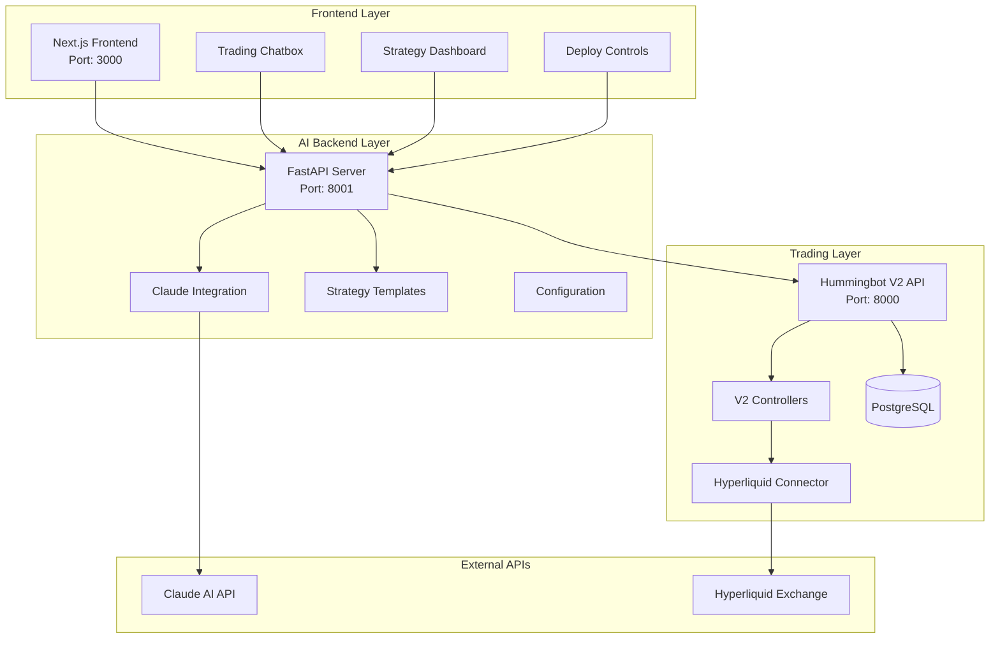

# AI Trading Agent - Project Architecture

## 🏗️ **System Overview**

The AI Trading Agent is a comprehensive trading system that combines AI-powered strategy generation with live trading execution through Hummingbot V2. The system consists of three main components working together to provide seamless trading automation.



## 🎨 **Frontend Layer - Next.js Application**

### **Technology Stack**
- **Framework**: Next.js 15.4.4 with Turbopack
- **Language**: TypeScript
- **Styling**: Tailwind CSS
- **UI Components**: Lucide Icons
- **Font**: Poppins (Google Fonts)

### **Architecture**
```
frontend/
├── src/
│   ├── app/
│   │   ├── layout.tsx          # Root layout with Poppins font
│   │   ├── page.tsx            # Main page component
│   │   └── globals.css         # Global styles
│   └── components/
│       └── TradingChatbox.tsx  # Main chat interface
├── public/                     # Static assets
├── package.json               # Dependencies
└── next.config.ts            # Next.js configuration
```

### **Key Components**

#### **TradingChatbox.tsx** - Main Interface
- **Real-time Chat**: AI-powered conversation interface
- **Strategy Display**: Formatted strategy responses with syntax highlighting
- **Action Buttons**: Deploy and backtest functionality
- **Status Panel**: Live strategy monitoring dashboard
- **Performance Metrics**: P&L, trades, win rates

#### **Features**
- **Dark Theme**: Professional trading interface
- **Responsive Design**: Mobile and desktop optimized
- **Real-time Updates**: WebSocket-like polling for status
- **Error Handling**: Graceful fallbacks and user feedback

### **API Integration**
```typescript
// All API calls target AI Backend on port 8001
const API_BASE = 'http://localhost:8001';

// Core endpoints
POST /chat          // Claude AI conversations
POST /deploy        // Strategy deployment
POST /backtest      // Strategy backtesting
GET  /strategies    // List active strategies
POST /strategy/{id}/stop  // Stop strategy
```

## 🧠 **AI Backend Layer - FastAPI Server**

### **Technology Stack**
- **Framework**: FastAPI (async Python web framework)
- **AI Integration**: Anthropic Claude API
- **Trading Integration**: Hummingbot V2 REST API
- **Async HTTP**: aiohttp for external API calls
- **Configuration**: JSON-based config management

### **Architecture**
```
backend/
├── api_server.py              # Main FastAPI application
├── claude_integration.py     # Claude AI integration
├── hummingbot_v2_integration.py  # Hummingbot V2 API client
├── config.py                 # Configuration management
├── ai-agent/
│   ├── strategy_templates.py # Trading strategy templates
│   └── ai_processor.py      # AI processing logic
├── mcp-server/
│   ├── mcp_server.py        # MCP protocol server
│   └── hyperliquid_connector.py  # Hyperliquid API client
└── data/
    └── api_client.py        # Data layer
```

### **Core Components**

#### **api_server.py** - FastAPI Application
```python
# Main endpoints
@app.post("/chat")           # Claude AI chat
@app.post("/deploy")         # Strategy deployment
@app.post("/backtest")       # Strategy backtesting
@app.get("/strategies")      # List strategies
@app.post("/strategy/{id}/stop")  # Stop strategy
@app.get("/health")          # Health check
```

#### **claude_integration.py** - AI Processing
- **Claude API Client**: Anthropic integration
- **Message Processing**: Natural language understanding
- **Strategy Generation**: AI-powered strategy creation
- **Context Management**: Conversation state handling

#### **hummingbot_v2_integration.py** - Trading Integration
```python
class HummingbotV2Controller:
    # Core methods
    async def create_controller_config()  # Generate V2 configs
    async def deploy_strategy()          # Deploy to Hummingbot
    async def stop_strategy()            # Stop running strategies
    async def get_strategy_status()      # Monitor performance
```

#### **strategy_templates.py** - Trading Strategies
- **RSI Directional**: Technical trend following
- **Market Making**: Liquidity provision strategies  
- **Conservative**: Low-risk approaches
- **Aggressive Scalping**: High-frequency trading

### **Configuration Management**
```json
// config.local.json
{
  "anthropic": {
    "api_key": "sk-ant-...",
    "model": "claude-3-5-sonnet-20241022"
  },
  "hyperliquid": {
    "api_wallet": "0x...",
    "api_key": "0x..."
  },
  "server": {
    "port": 8001,
    "cors_origins": ["http://localhost:3000"]
  }
}
```

## 🤖 **Trading Layer - Hummingbot V2 Server**

### **Technology Stack**
- **Platform**: Hummingbot V2.5.0
- **API Framework**: FastAPI (separate from AI backend)
- **Database**: PostgreSQL 15
- **Message Broker**: EMQX MQTT
- **Dashboard**: Streamlit (port 8501)
- **Containerization**: Docker Compose

### **Architecture**
```
hummingbot/
├── controllers/           # V2 Strategy Controllers
│   ├── directional_trading/
│   │   ├── dman_v3.py    # RSI/Bollinger strategy
│   │   ├── macd_bb_v1.py # MACD strategy
│   │   └── supertrend_v1.py
│   ├── market_making/
│   │   ├── pmm_simple.py # Pure market making
│   │   └── pmm_dynamic.py
│   └── generic/
│       ├── arbitrage_controller.py
│       └── grid_strike.py
├── connector/
│   └── exchange/
│       └── hyperliquid/  # Native Hyperliquid connector
├── strategy_v2/          # V2 Framework
│   ├── controllers/
│   ├── executors/
│   └── models/
└── hummingbot/           # Core bot logic
```

### **Docker Services**
```yaml
services:
  hummingbot-api:         # Main API server (port 8000)
  hummingbot-postgres:    # Database (port 5432)  
  hummingbot-broker:      # MQTT broker (port 1883)
  dashboard:              # Web dashboard (port 8501)
```

### **Key Controllers Used**

#### **dman_v3** - Directional Trading
- **Strategy Type**: RSI + Bollinger Bands
- **Use Case**: AI-generated RSI strategies
- **Parameters**: Period, thresholds, position sizing
- **Risk Management**: Stop loss, take profit, trailing stops

#### **pmm_simple** - Market Making
- **Strategy Type**: Pure market making
- **Use Case**: Liquidity provision strategies
- **Parameters**: Spreads, amounts, refresh time
- **Features**: Inventory skew, dynamic pricing

### **API Integration Points**
```python
# Key endpoints used by AI Backend
GET  /bot-orchestration/status      # Bot status
POST /bot-orchestration/deploy-v2-controllers  # Deploy strategy
POST /bot-orchestration/stop-bot    # Stop strategy
GET  /controllers/configs/          # List configurations
POST /controllers/configs/{id}      # Create configuration
```

## 🔄 **Data Flow Architecture**

### **1. Strategy Generation Flow**
```
User Input → Frontend → AI Backend → Claude API
                          ↓
Strategy Template ← AI Processing ← Claude Response
                          ↓
Hummingbot Config → V2 Controller → Live Trading
```

### **2. Deployment Flow**
```
Deploy Button → Frontend API Call → AI Backend
                                      ↓
Strategy Parsing → Hummingbot V2 API → Controller Creation
                                      ↓
Live Trading ← Hyperliquid Connector ← Strategy Execution
```

### **3. Status Monitoring Flow**
```
Frontend Polling → AI Backend → Hummingbot V2 API
                                      ↓
Performance Data ← Database ← Strategy Execution
                                      ↓
UI Updates ← Status Aggregation ← Real-time Metrics
```

## 🌐 **Network Architecture**

### **Port Allocation**
- **Frontend (Next.js)**: Port 3000
- **AI Backend (FastAPI)**: Port 8001  
- **Hummingbot V2 API**: Port 8000
- **PostgreSQL**: Port 5432
- **MQTT Broker**: Port 1883
- **Dashboard**: Port 8501

### **Service Communication**
```
Frontend (3000) ──→ AI Backend (8001) ──→ Hummingbot API (8000)
                           ↓                        ↓
                    Claude API                PostgreSQL (5432)
                           ↓                        ↓
                    Hyperliquid API           MQTT Broker (1883)
```

## 🔧 **Deployment Architecture**

### **Development Environment**
```bash
# Terminal 1: Start Hummingbot V2 services
docker-compose up -d

# Terminal 2: Start AI Backend
source venv/bin/activate
python start_backend.py

# Terminal 3: Start Frontend
npm run dev
```

### **Production Considerations**
- **Load Balancing**: Multiple AI backend instances
- **Database**: Separate PostgreSQL for strategy data
- **Monitoring**: Prometheus + Grafana integration
- **Security**: API authentication, HTTPS termination
- **Scaling**: Kubernetes deployment manifests

## 📊 **Technology Integration Matrix**

| Component | Technology | Purpose | Port |
|-----------|------------|---------|------|
| Frontend | Next.js 15 | User Interface | 3000 |
| AI Backend | FastAPI | Strategy Processing | 8001 |
| Hummingbot API | FastAPI | Trading Engine | 8000 |
| Database | PostgreSQL 15 | Data Persistence | 5432 |
| Message Broker | EMQX | Real-time Updates | 1883 |
| Dashboard | Streamlit | Monitoring UI | 8501 |

## 🎯 **Key Features Delivered**

### **AI-Powered Strategy Generation**
- Natural language strategy requests
- Personalized trader analysis
- Risk-appropriate recommendations
- Real-time strategy refinement

### **Seamless Trading Integration**
- Direct Hummingbot V2 deployment
- Native Hyperliquid connectivity
- Real-time performance monitoring
- Automated risk management

### **Professional User Experience**
- Dark theme trading interface
- Real-time strategy dashboard
- One-click deployment
- Performance analytics

### **Robust Architecture**
- Microservices design
- Async/await throughout
- Comprehensive error handling
- Scalable infrastructure

This architecture provides a production-ready foundation for AI-powered automated trading with seamless integration between AI strategy generation and live trading execution.